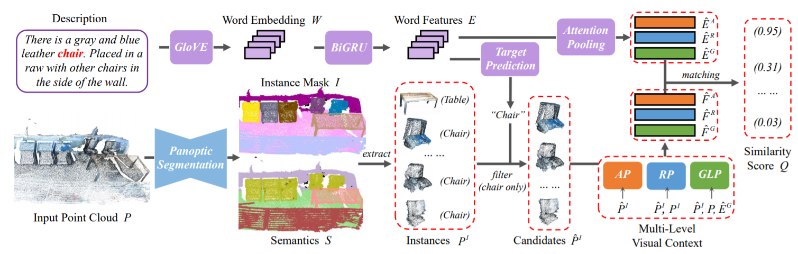
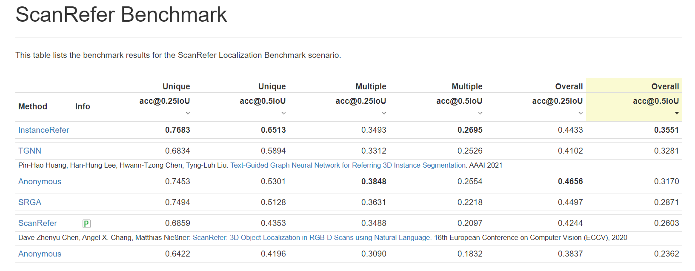

# InstanceRefer
### InstanceRefer: Cooperative Holistic Understanding for Visual Grounding on Point Clouds through Instance Multi-level Contextual Referring

This repository is for the 1st method on ScanRefer benchmark [[arxiv paper]](https://arxiv.org/pdf/2103.01128.pdf).

Zhihao Yuan, [Xu Yan](https://github.com/yanx27), Yinghong Liao, Ruimao Zhang, [Zhen Li*](https://mypage.cuhk.edu.cn/academics/lizhen/), Shuguang Cui



If you find our work useful in your research, please consider citing:
```
@InProceedings{yuan2021instancerefer,
  title={InstanceRefer: Cooperative Holistic Understanding for Visual Grounding on Point Clouds through Instance Multi-level Contextual Referring},
  author={Zhihao Yuan, Xu Yan, Yinghong Liao, Ruimao Zhang, Zhen Li, Shuguang Cui},
  journal={arXiv preprint},
  year={2021}
}
```
## News
* 2021-03-31 We release InstanceRefer v1 :rocket:!
* 2021-02-22 We achieve 1st place in [ScanRefer](http://kaldir.vc.in.tum.de/scanrefer_benchmark/) leaderboard.


## Getting Started


## Setup
The code is tested on Ubuntu 16.04 LTS & 18.04 LTS with PyTorch 1.3.0 CUDA 10.1 installed. 

```shell
conda install pytorch==1.3.0 cudatoolkit=10.1 -c pytorch
```

Install the necessary packages listed out in `requirements.txt`:
```shell
pip install -r requirements.txt
```
After all packages are properly installed, please run the following commands to compile the [torchsaprse](https://github.com/mit-han-lab/torchsparse):
```shell
cd lib/torchsparse/
python setup.py install
```
__Before moving on to the next step, please don't forget to set the project root path to the `CONF.PATH.BASE` in `lib/config.py`.__


### Data preparation
1. Download the ScanRefer dataset and unzip it under `data/`. 
2. Downloadand the preprocessed [GLoVE embeddings (~990MB)](http://kaldir.vc.in.tum.de/glove.p) and put them under `data/`.
3. Download the ScanNetV2 dataset and put (or link) `scans/` under (or to) `data/scannet/scans/` (Please follow the [ScanNet Instructions](data/scannet/README.md) for downloading the ScanNet dataset). After this step, there should be folders containing the ScanNet scene data under the `data/scannet/scans/` with names like `scene0000_00`
4. Used official and pre-trained [PointGroup](https://github.com/Jia-Research-Lab/PointGroup) generate panoptic segmentation in `PointGroupInst/`. We provide pre-processed data in [Baidu Netdisk [password: 0nxc]](https://pan.baidu.com/s/1j9XCxPhaPECk4OczhjDxAA).
5. Pre-processed instance labels, and new data should be generated in  `data/scannet/pointgroup_data/`
```shell
cd data/scannet/
python prepare_data.py --split train --pointgroupinst_path [YOUR_PATH]
python prepare_data.py --split val   --pointgroupinst_path [YOUR_PATH]
python prepare_data.py --split test  --pointgroupinst_path [YOUR_PATH]
```
Finally, the dataset folder should be organized as follows.
```angular2
InstanceRefer
├── data
│   ├── scannet
│   │  ├── meta_data
│   │  ├── pointgroup_data
│   │  │  ├── scene0000_00_aligned_bbox.npy
│   │  │  ├── scene0000_00_aligned_vert.npy
│   │  ├──├──  ... ...

```

### Training
Train the InstanceRefer model. You can change hyper-parameters in `config/InstanceRefer.yaml`:
```shell
python scripts/train.py --log_dir instancerefer
```


## TODO

- [ ] Updating to the best version.
- [ ] Release codes for prediction on benchmark.
- [ ] Release pre-trained model.
- [ ] Merge PointGroup in an end-to-end manner.


## Acknowledgement
This project is not possible without multiple great opensourced codebases. 
* [ScanRefer](https://github.com/daveredrum/ScanRefer)
* [PointGroup](https://github.com/Jia-Research-Lab/PointGroup)
* [torchsaprse](https://github.com/mit-han-lab/torchsparse)
* [pytorch_geometric](https://github.com/rusty1s/pytorch_geometric)
## License
This repository is released under MIT License (see LICENSE file for details).
