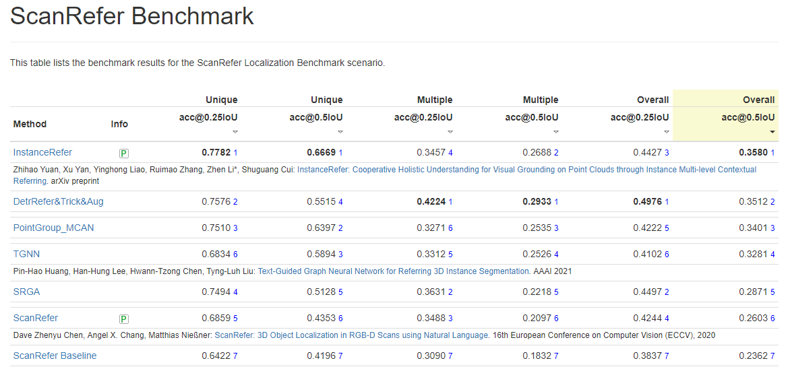

# InstanceRefer
### InstanceRefer: Cooperative Holistic Understanding for Visual Grounding on Point Clouds through Instance Multi-level Contextual Referring

This repository is for the 1st method on ScanRefer benchmark [[arxiv paper]](https://arxiv.org/pdf/2103.01128.pdf).

Zhihao Yuan, [Xu Yan](https://github.com/yanx27), Yinghong Liao, Ruimao Zhang, [Zhen Li*](https://mypage.cuhk.edu.cn/academics/lizhen/), Shuguang Cui


If you find our work useful in your research, please consider citing:
```
@InProceedings{yuan2021instancerefer,
  title={InstanceRefer: Cooperative Holistic Understanding for Visual Grounding on Point Clouds through Instance Multi-level Contextual Referring},
  author={Zhihao Yuan, Xu Yan, Yinghong Liao, Ruimao Zhang, Zhen Li, Shuguang Cui},
  journal={arXiv preprint},
  year={2021}
}
```
## News
* 2021-02-22 We achieve 1st place in [ScanRefer](http://kaldir.vc.in.tum.de/scanrefer_benchmark/) leaderboard.


## Comming Soon...


